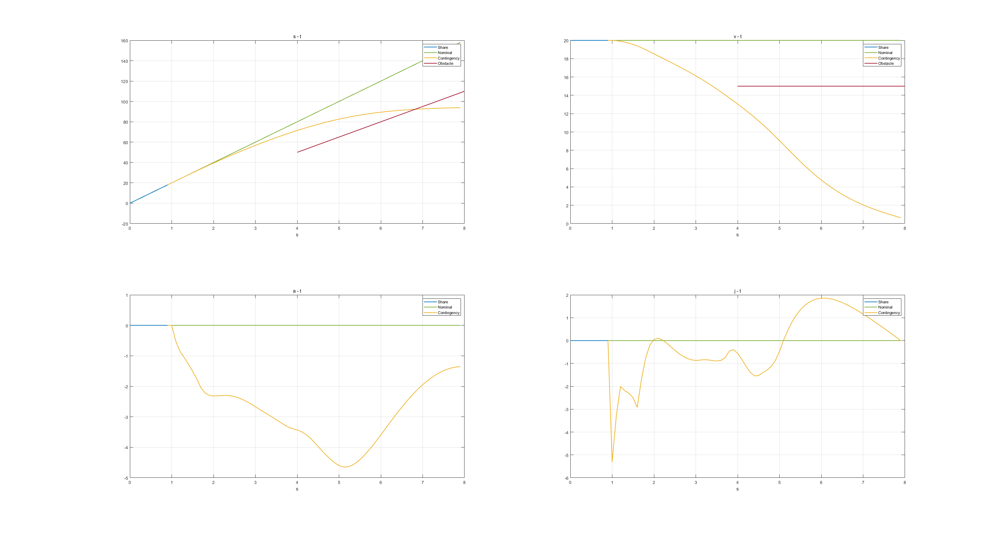
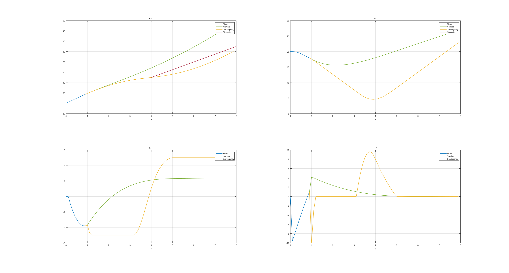
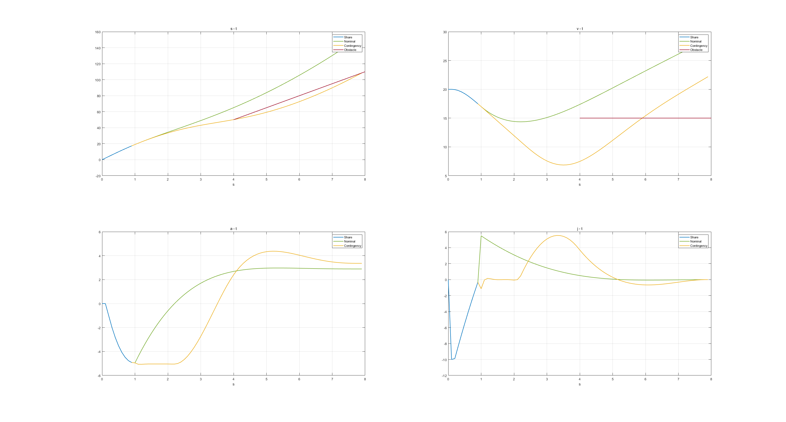

# Contingency Speed Planning

简单实现。

## 1. Control Model

- 状态变量：$x = [s, v, a]^T$;
- 控制变量：$u = [j]$;
- 运动学模型：$\dot{x} = A x + B u$;

$$
A = \left[\begin{matrix}
0 & 1 & 0 \\
0 & 0 & 1 \\
0 & 0 & 0 \\
\end{matrix}\right]
,
B = \left[\begin{matrix}
0  \\
0  \\
1  \\
\end{matrix}\right]
$$

- 优化函数：$J = J_{share} + P_n J_{n} + P_c J_{c}$
  $$
  J_{share} = J_{n} = J_{c} = w_{j} j^2 + w_{s} (s-s_{ref})^2 + w_{v} (v-v_{ref})^2
  $$
将匀速行驶作为参考位置和速度。
  
- 约束条件：

  - 起点约束；
  - 运动学约束；
  - 碰撞约束；

  

# 2. Config

config.m中为参数设置。

- 优化问题权重；
- 状态变量和控制变量限制；
- 事件概率；
- 规划时域设置；
- 主车初始状态设置；
- CutIn车辆设置；

# 3. Planner

contingency planning优化求解；

# 4. PlotResults

画图。

# 5. 运行

main.m

- cut in概率为0：

- cut in概率为0.1：

- cut in概率为0.7：

